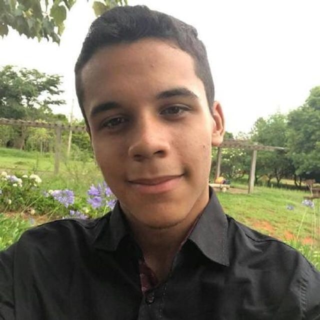

# Hemovida

## Sobre 
O Hemovida é um aplicativo móvel multiplataforma, gratuito, que possibilita realizar a captação de doadores de sangue, apoiando os hemocentros da rede pública de saúde do Brasil a divulgar informações pertinentes ao público e campanhas de doação de sangue.
Suas principais funcionalidades são:
- Listar hemocentro.
- Detalhar dados do hemocentro.
- Traçar rota.
- Apresentar Geolocalização dos hemocentros.
- Divulgar campanhas publicitárias.
- Compartilhar campanha via rede social.
- Regras para doação de sangue.
- Espaço do doador de sangue.
- Compartilhar localização.
- Histórico de doações (minhas doações).
- Avaliar hemocentro.
- Agendar doação de sangue.
- Apresentar avisos e alertas.
- Convidar um amigo a doar sangue.

## Integrantes
<table>
    <tr>
        <td align="center"><a href="https://github.com/JaimeJuan11" target="_blank"> <b>Jaime Juan de Castro Feliciano Damasceno</b></a> </td>
        <td align="center"><a href="https://github.com/LorrayneCardozo" target="_blank"> <b>Lorrayne Alves Cardozo</b></a> </td>
        <td align="center"><a href="https://github.com/GuilhermeBraz" target="_blank"> <b>Guilherme Verissimo Cerveira Braz</b></a> </td>
        <td align="center"><a href="https://github.com/joao15victor08" target="_blank"> <b>João Victor de Oliveira Matos</b></a> </td>
        <td align="center"><a href="https://github.com/V100k" target="_blank"> <b>Victor Hugo SIqueira Costa</b></a> </td>
    </tr>
</table>