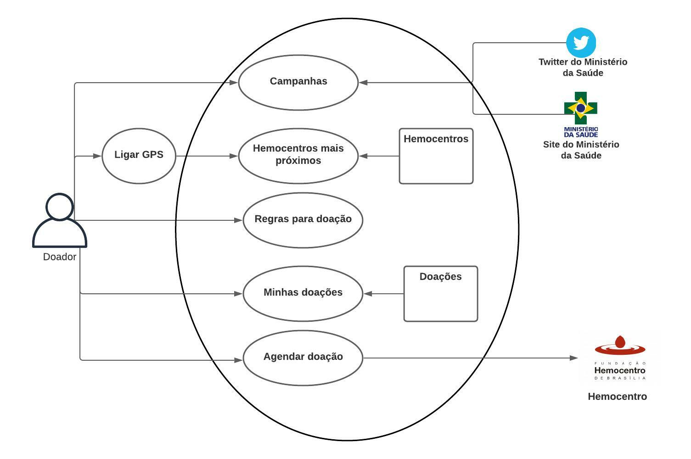

# 
Rich Picture

# Histórico de Revisão
Versão | Data | Autor | Descrição
:-:|:-:|:-:|:-:
1.0 | 31/07/2021 | Lorrayne Cardozo | Adicionando primeira versão do Rich Picture

# Introdução
Um Rich Picture é uma ferramenta construída, preferencialmente, juntamente com stakeholders que ilustra os principais elementos e relações a serem considerados, afim de identificar os processos e requisitos do sistema. Não há formalidades em um Rich Picture, porém, é uma boa prática que seja compreensível pelos demais envolvidos no projeto, sejam eles desenvolvedores ou não.

# Rich Pictures
## Versão 1

# Referências
Multi-Stakeholder Partinerships. Disponível em < http://www.mspguide.org/tool/rich-picture >. Acesso em: 31 de julho de 2021.